# citi-frontend

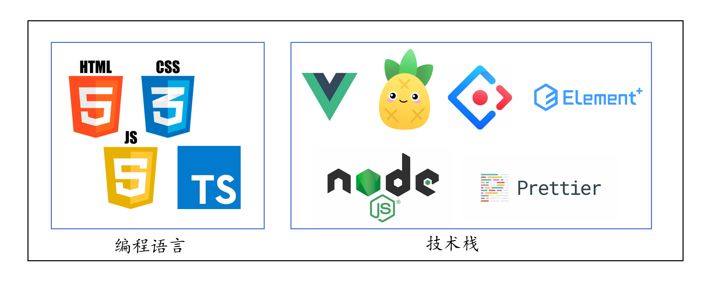

#### 跳转逻辑设计

根据主要功能，从导航栏分别可跳转到主页、股权问答、股权查询和新闻资讯。在主要功能页下，会跳转到各自的分页面。比如在股权查询部分，可跳转到公司基本信息、财务信息、股东股本等信息页面。

#### 用户界面设计

选用蓝色为主色调，并提前预设好主色板、中性色色板、红色等常用色板，统一字体和各部分字号大小，设计晰、简洁的用户界面，并保持确保整个平台的视觉元素的一致性。

设计按钮和控件时，使用主色调的不同阴影来区分不同的状态（如默认、悬停、点击、禁用），保持界面的一致性和美观。

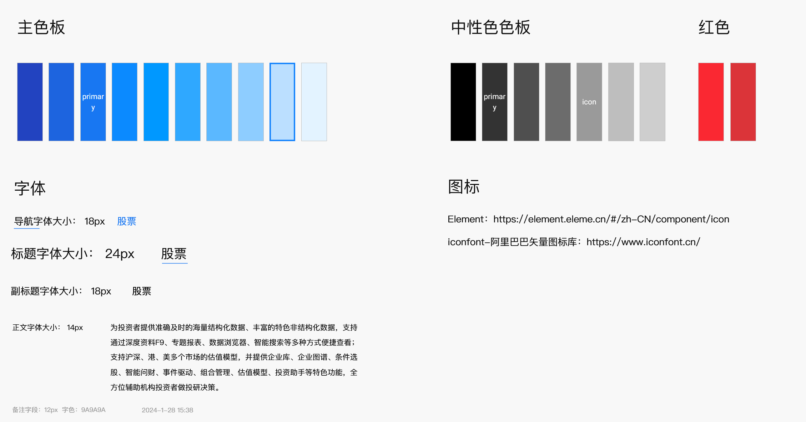

#### 用户体验设计

**导航简便**：确保用户可以轻松地找到他们需要模块和信息。

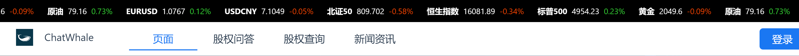

**交互式反馈**：对用户的操作给予即时反馈，如消息提醒和错误提示等。

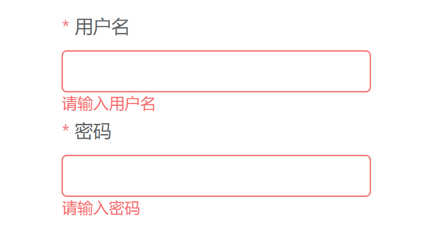

#### 组件化设计

- 基础组件：如按钮、输入框和图表组件，在多个页面中复用，增加系统的可修改和可扩展性。
- 功能组件：实现特定功能的组件，如新闻概览组件、聊天窗口组件。
- 布局组件：用于定义应用布局的组件，如导航栏、侧边栏。

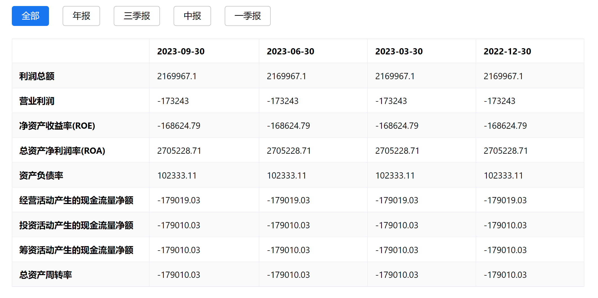

## 功能说明

### 公司股权信息查询

客户输入公司名称/公司代码/公司拼音等信息，系统记录搜索记录，并显示公司基本信息，包括公司名称、注册地、成立日期等公司信息，之后显示成交量、总股本、流通股本、市盈率等股权基本信息。

系统可以可视化展示股权结构图，用户可以与结构图进行交互。用户还可以选择股本结构、十大股东、十大流通股东、股东人数、基金持股查看更详细的信息。

### 股权信息问答

客户能方便通过对话的形式了解股权信息。用户选择一个历史问答或新建一个问答，系统会生成提示词，用户输入股权信息相关问题后系统会智能给出答复，回答股权信息相关问题并保存到历史记录方便下次查看。

### 公司变更、金融股市相关新闻

客户可以浏览最近的和金融股市相关的新闻，点进新闻标题可以阅读新闻具体内容。系统会推荐最新的和精选的新闻供客户阅读。

## 产品展示

### 首页界面

在首页，用户可以看到我们的项目核心价值观”数据创造价值，AI引领投资“。

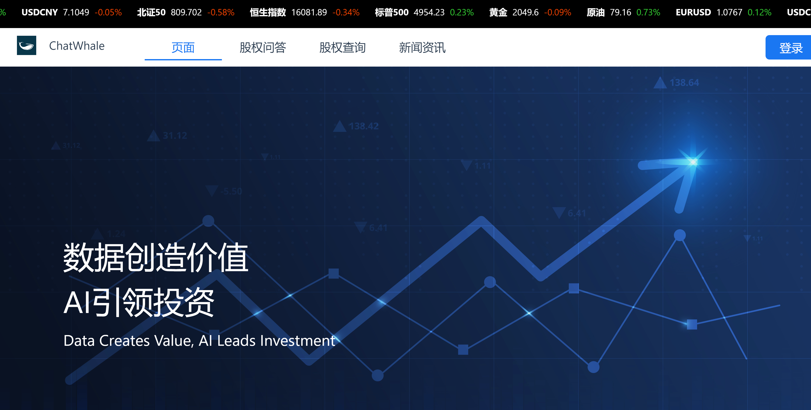

接着，从金融信息智能问答、金融数据准确查询、股权架构识别分析三个方面介绍了ChatWhale股权问答平台的核心功能和竞争力。

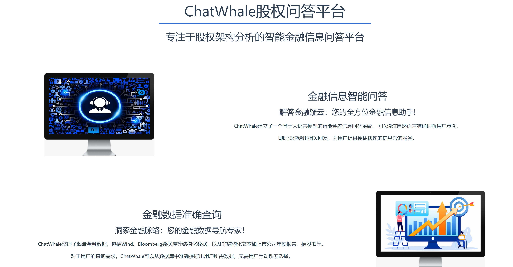

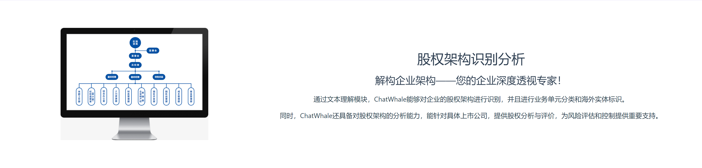

首页末尾，是关于我们的团队总体介绍、指导老师介绍以及组员经历与分工介绍。

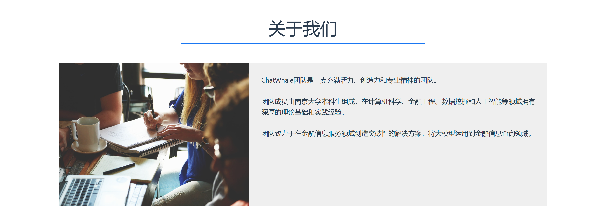

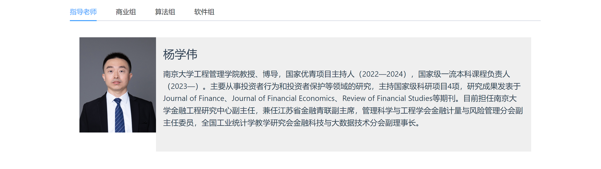

### 模型聊天界面

- 侧栏：提供了对历史对话的管理，包括新建对话、删除单个对话、删除全部对话、编辑对话标题、根据标题搜索对话等功能，并提供了对操作的反馈。
  - 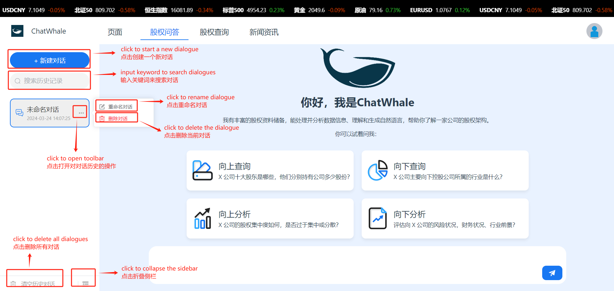
  - 用户可以通过点击历史对话卡片右侧的“更多”图标，选择进行编辑标题与删除单个对话的操作。
  - 用户可以点击底部“清空历史对话”，来删除所有的历史对话。
  - 用户可以点击底部右侧的“折叠”图标收起侧栏，达到更专注的对话效果。折叠状态下可以点击左侧“展开”图标来展开侧栏。
  - 用户可以点击不同历史对话卡片切换当前对话，当前所处对话的卡片被标注为蓝色边框便于识别。
- 对话区域：
  - 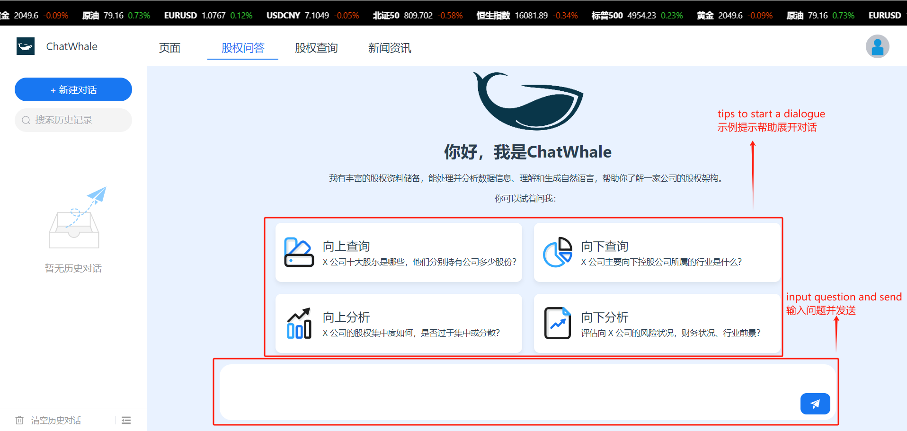
  - 示例问题：初始聊天时，系统围绕领域四大板块给出了示例问题，帮助您更好地展开对话。
  - 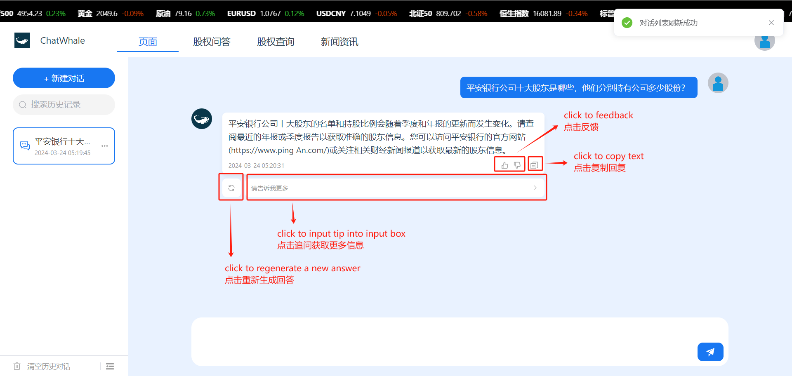
  - 反馈与复制：每条大模型回复下方，均设置了反馈与复制按钮。用户可以点击“复制”图标复制模型回复到剪贴板，成功复制系统会进行提示
  - 重新生成：最后一条回复下方设置了“重新生成”按钮。若用户对大模型回复不满意，可以点击使大模型进行重新回复。
  - 追问提示：最后一条回复下方设置了“请告诉我更多”的追问提示，便于用户编辑而获取更多信息。

### 公司信息查询界面

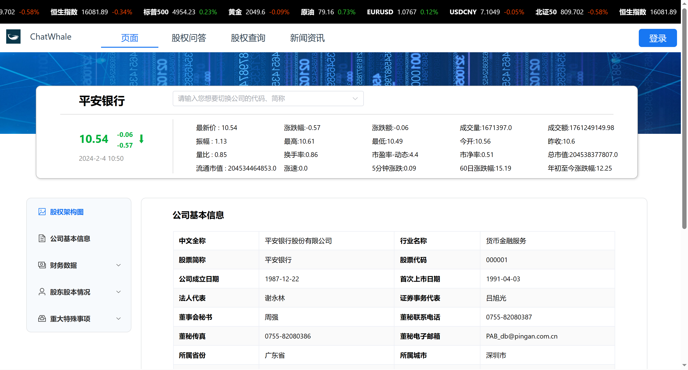

- 页面上方横栏展示该公司基本的股票数据

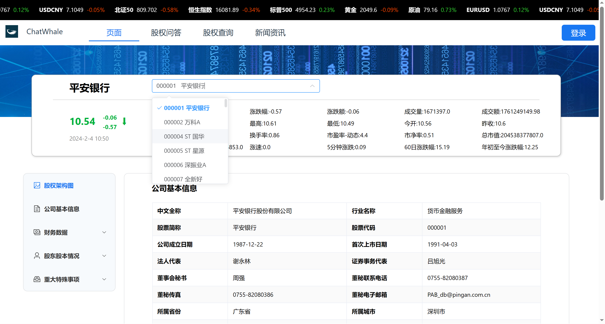

- 点击输入框可输入目标公司的代码或公司名称，同时提供切换选项，点击选项即可进行公司切换。

#### 股权架构图

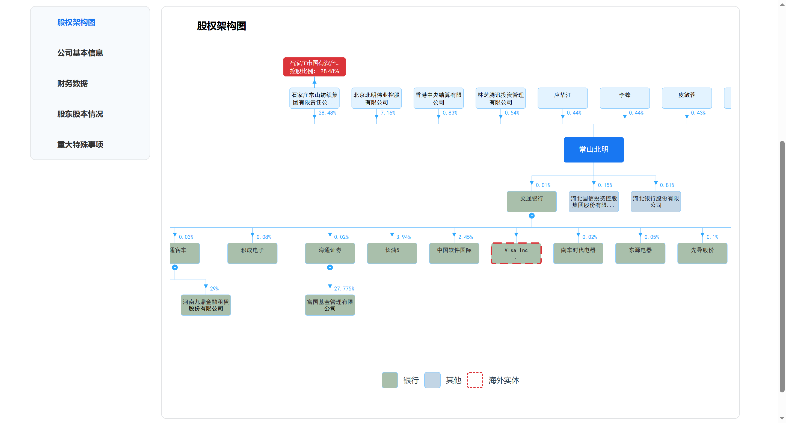

- 点击左侧导航栏，选中股权架构图，即可查看该公司股权架构图
- 股权架构图中包含十大股东信息，股权投资信息，实际控制人信息，公司的行业分类以及海外实体识别
- 用户可以拖拽移动，缩放股权架构图

#### 公司基本信息

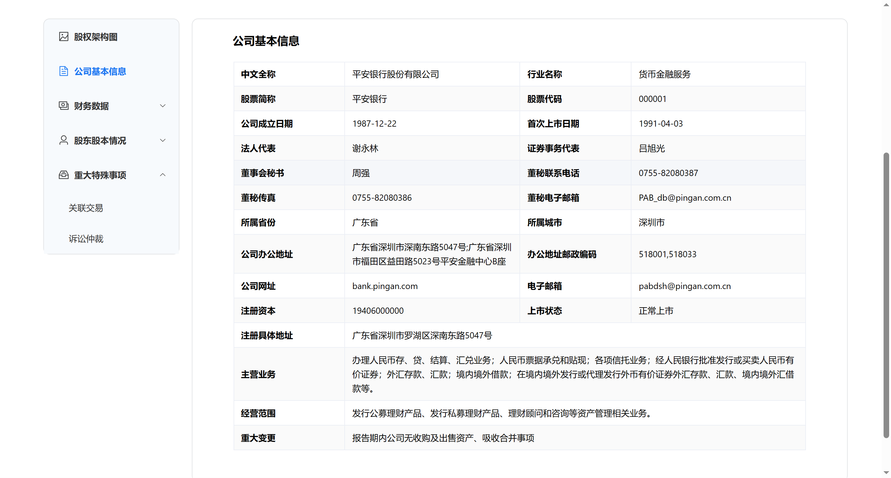

- 点击左侧导航栏，选中公司基本信息，即可查看该公司基本信息

#### 财务数据 

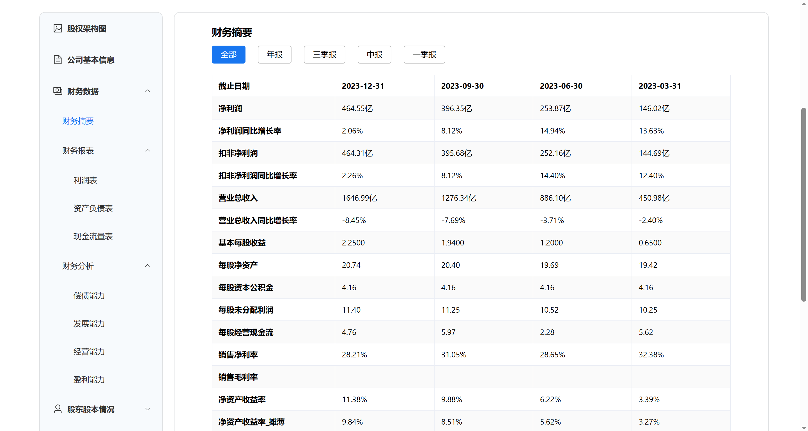

- 点击左侧导航栏，选中财务数据-财务摘要，查看公司财务摘要信息（其他财务数据同理）

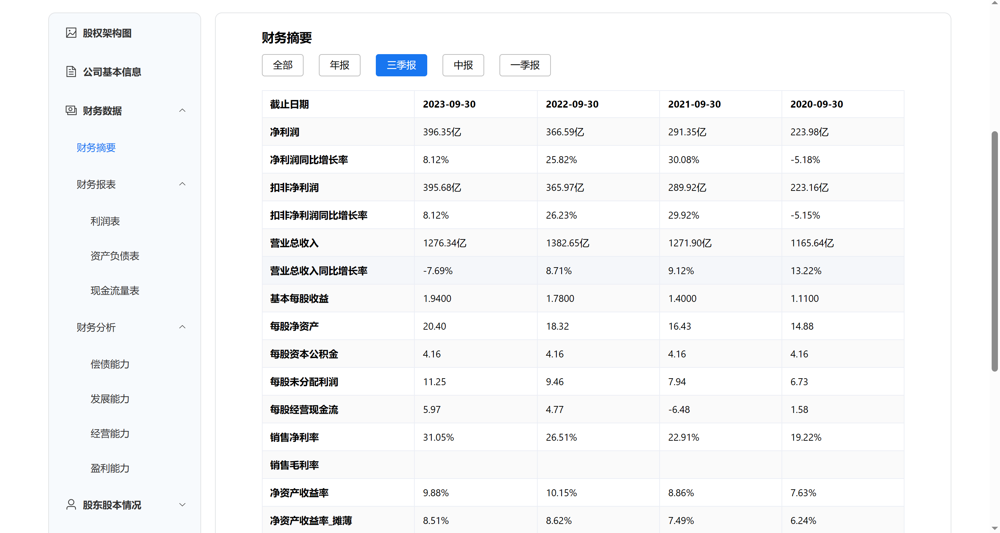

- 点击“全部”“年报”“三季报”“中报”“一季报”切换时间，即可查看不同时间的财务摘要（其他财务数据同理）

#### 股东股本情况

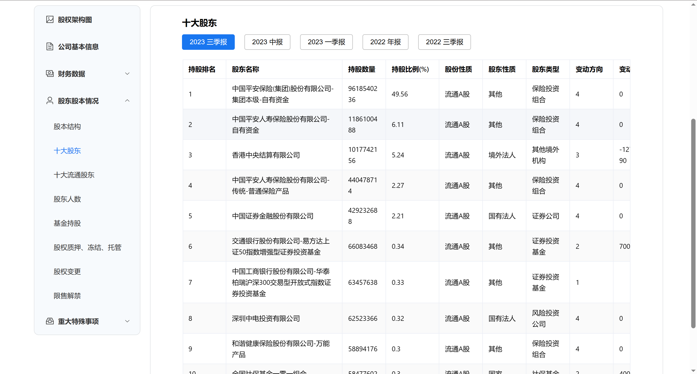

- 点击左侧导航栏，选中股东股本情况-十大股东，查看十大股东情况（其他股东股本情况同理）

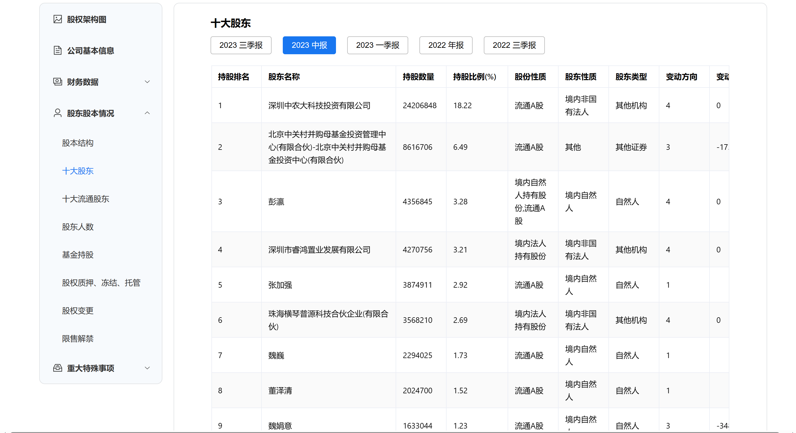

- 点击“2023三季报”“2023中报”“2023一季报”“2022年报”“2022三季报”切换时间，即可查看不同时间的十大股东情况（其他股东股本情况同理）

#### 重大特殊事项

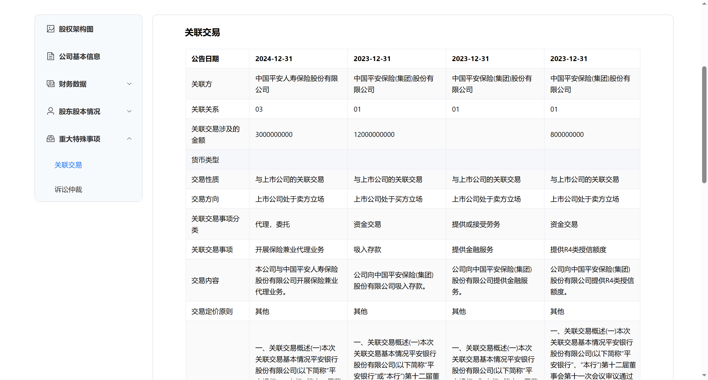

- 点击左侧导航栏，选中重大特殊事项-关联交易，查看该公司重大特殊事项（其余同理）

### 新闻浏览界面

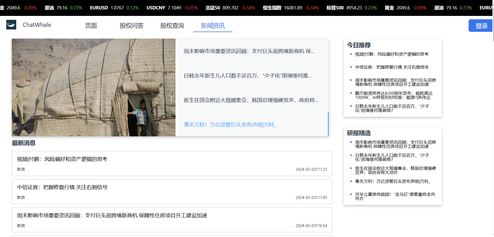

- 新闻主页显示系统的今日推荐以及精选的新闻，下滑可浏览更多最近的新闻资讯（按时间顺序排序）。点击新闻跳转到新闻详情页面

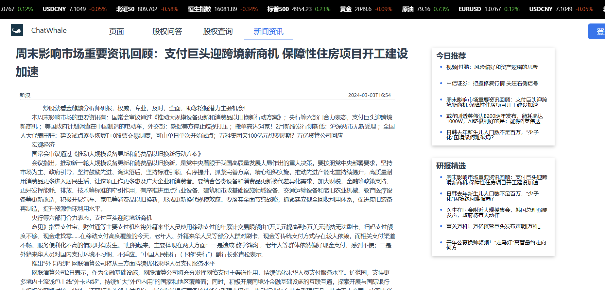

- 用户在新闻详情页面浏览新闻，点击右侧今日推荐和研报精选的内容可跳转到其他新闻详情页面。
